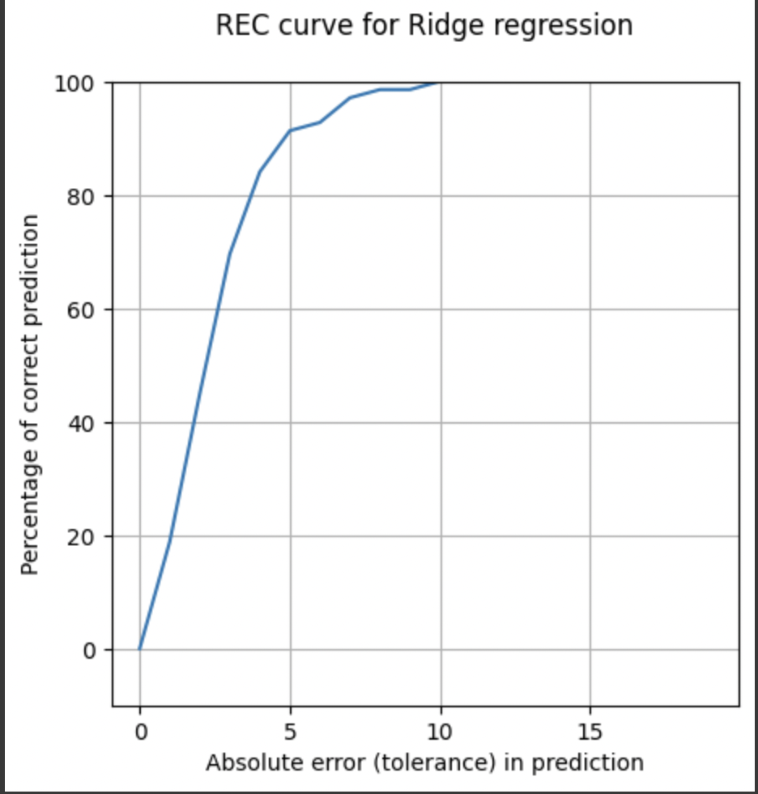

## Final Project 

The primary goal of this project is to leverage machine learning techniques to explore and understand the correlation between blood test indicators of liver disease and the number of alcoholic drinks consumed per day. By establishing this connection, the project aims to investigate the potential risk factors associated with alcohol consumption and their impact on liver health. I am interested to see if the number of drinks found to be correlated to a risk of liver disease, is over or under the national recommendation for a healthy amount. Training this model to predict the percentage of adult men at risk for liver diseases will allow us to see how far above or below the nationals official guidelines to how many drinks a day for adult men. The national guideline for alcohol consumption limits intake to 2 drinks per day. The target variable in the dataset represents the number of half-pint equivalents of alcoholic beverages drunk per day for adult men. So, I will use my model to compare the value of these two groups, and make inclinations from the results. 


Given the prevalence of alcohol-related health issues and the considerable impact on public health, this project contributes to the ongoing national conversation surrounding responsible alcohol consumption. By employing machine learning, the project enhances the understanding of the complex interplay between blood test indicators and alcohol intake, providing valuable insights for health practitioners, policymakers, and the general public.


The project begins with the exploration and analysis of a comprehensive dataset obtained from the UC Irvine Machine Learning Repository. This dataset includes variables representing blood test results that are indicative of liver disorders. There are 5 categories of blood tests used; mean corpuscular volume (mcv), alkaline phosphatase (alkphos), alanine aminotransferase (sgpt), aspartate aminotransferase (sgot), and gamma-glutamyl transpeptidase (gammagt). Additionally, the dataset provides insights into the daily consumption of alcoholic beverages for adult men. There are 345 instances of each category including daily alcohol intake, and there are no missing values. The key focus is to scrutinize the relationships between these variables and identify patterns that could suggest a risk for liver diseases.


The threshold for each blood test used is as follows; 


A value above or below the levels indicated below, 

**MCV** > 100 


**Alkphos** < 44 


**SGPT** > 56


**SGOT** > 50 


**GAMMAGT** > 30 


The core of the project revolves around the application of machine learning techniques to predict the percentage of adult men at risk for liver diseases based on their blood test results and alcohol consumption. By splitting the data into training and testing groups in the model, the project aims to quantify the correlation between these factors and provide a feature for assessing the potential risk associated with varying levels of alcohol intake.

One of the unique aspects of this project is the direct comparison of the model predictions with the national guidelines for alcohol consumption. The U.S. The National Institute on Alcohol Abuse and Alcoholism recommends limiting alcohol intake to 2 drinks per day for adult men. The project will assess how well the machine learning model aligns with these guidelines, aiming to shed light on the extent to which individuals in the dataset may be deviating from the recognized benchmarks for a healthy lifestyle. The individuals in the data set are meant to represent average and common individuals, who vary naturally in their alcohol intake. 

Machine learning techniques are particularly apt for this project due to the intricate relationships within the dataset. Traditional statistical methods may struggle to capture nonlinear patterns and interactions among multiple variables. Machine learning, on the other hand, can process more complex patterns and make predictions based on the data. Because of this, Machine Learning enables the development of a predictive model that can offer further insights into the risk factors associated with impact of alcohol consumption, specifically on your liver.

The project hinges on the assumption that certain blood test values can provide insights into liver health, and there exists a correlation between these values and the number of alcoholic drinks consumed per day.

Before diving into machine learning modeling, I explored the data, which involved the examination of the dataset's structure, distribution, and statistical properties. This step is crucial for understanding the range and variability of the variables that I am working with and trying to process, and gaining insights into any patterns or trends within the data. Visualizations, such as histograms and scatter plots are employed to create a comprehensive understanding of the dataset. Visuals make it easy to get a feel for the general percentages in the dataset. 

I made 6 histogram plots, one for each blood test type taken, and one for the distribution of reported drinks per day. I was intrigued to see that the second most common count for drinks per day was 4-5. This number is far higher than the national recommendation of 2. The most common record is 1 drink per day. There is wide variability across the 5 histograms for the blood tests. In every test group there are multiple values outside of the threshold for that blood test that would indicate a liver disorder. 


Once the initial analysis of visuals and interpretations is completed, the data gets preprocessed to ensure its format for machine learning algorithms is suitable. This would include handling missing values if there were any, it also includes defining categorical variables, and scaling numerical features. Given the nature of machine learning models, it is essential to standardize or normalize the data to ensure that variables with different scales contribute equally to the model.

In the efforts of predicting the percentage of adult men at risk for liver diseases based on blood test results and alcohol consumption, selecting the correct feature plays an important role. Not all variables necessarily contribute in an equal way to the prediction part of the model. We can use techniques such as ranking different features of the model to evaluate their impact on the prediction or we could use tree-based models to try and identify and retain the most relevant features to the prediction.


This project involves selecting an appropriate machine learning model for regression. Given the goal of the task is to predict, models like Support Vector Regression (SVR), Random Forest Regression, or Gradient Boosting Regression are considered. Multiple models may be trained and compared to determine which one performs best on the dataset. The dataset is split into training and testing sets to evaluate the model's performance on unseen data. In this project, I used 30% for the testing data and 70% for the training data. This is a typical percent splitage for testing and training data. 

To assess the model's accuracy and generalization capabilities, evaluation metrics such as Root Mean Squared Error (RMSE) are employed. RMSE quantifies the average difference between predicted and actual values, providing a measure of the model's predictive accuracy, and an insight into how the model is working. Other validation techniques may also be applied to obtain a more robust outlook of the model's abilities and performance. As previously stated, one distinctive aspect of the project involves comparing the model's predictions with the U.S. National Institute on Alcohol Abuse and Alcoholism's guidelines, which recommend limiting alcohol intake to 2 drinks per day for men. This step provides a practical benchmark for evaluating the real-world implications of the model's predictions, and why creating this model in the first place was important. The comparison sheds light on how closely individuals in the dataset adhere to established national health guidelines.

The methodology is not a linear process but an iterative one. As insights are gained from the initial models, the project may involve refining its features, adjusting  various parameters and thresholds created, or exploring alternative models to enhance the effectiveness of the predictions and the ability to interpret them in a meaningful way.


## Data  

Here is an overview of the dataset, how it was obtained and the preprocessing steps taken, with some plots!

 {width="50%" height="50%"}


## DATA


 {width="50%" height="50%"}


### ggg

 {width="50%" height="50%"}

*Figure 1: Here is a caption for my diagram. This one shows a pengiun [1].*

## Modelling

Here are some more details about the machine learning approach, and why this was deemed appropriate for the dataset. 

The model might involve optimizing some quantity. You can include snippets of code if it is helpful to explain things.

```python
from sklearn.ensemble import ExtraTreesClassifier
from sklearn.datasets import make_classification
X, y = make_classification(n_features=4, random_state=0)
clf = ExtraTreesClassifier(n_estimators=100, random_state=0)
clf.fit(X, y)
clf.predict([[0, 0, 0, 0]])
```

This is how the method was developed.

## Results

Figure X shows... [description of Figure X].

## Discussion

From Figure X, one can see that... [interpretation of Figure X].

## Conclusion

Here is a brief summary. From this work, the following conclusions can be made:
* first conclusion
* second conclusion

Here is how this work could be developed further in a future project.

## References
[1] DALL-E 3

[back](./)

